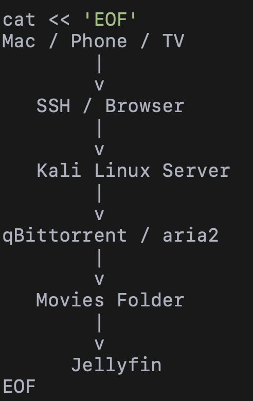
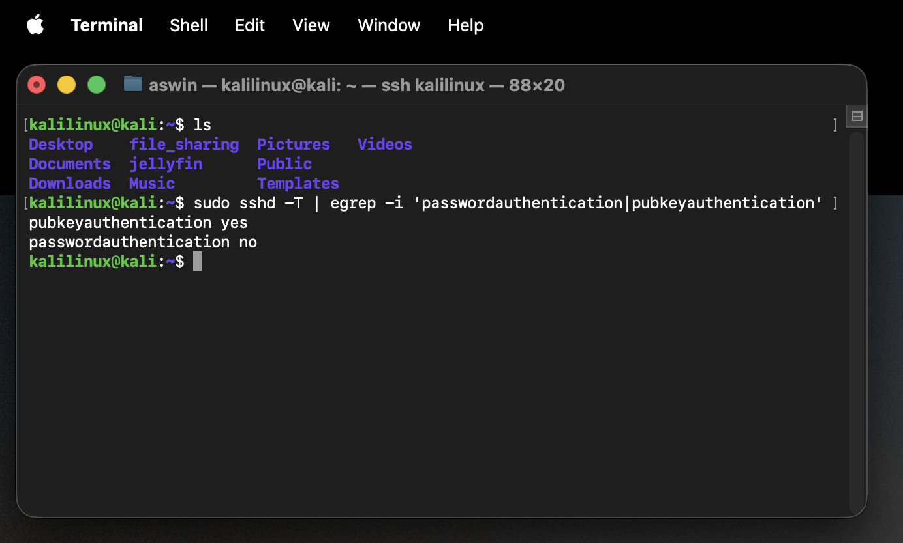
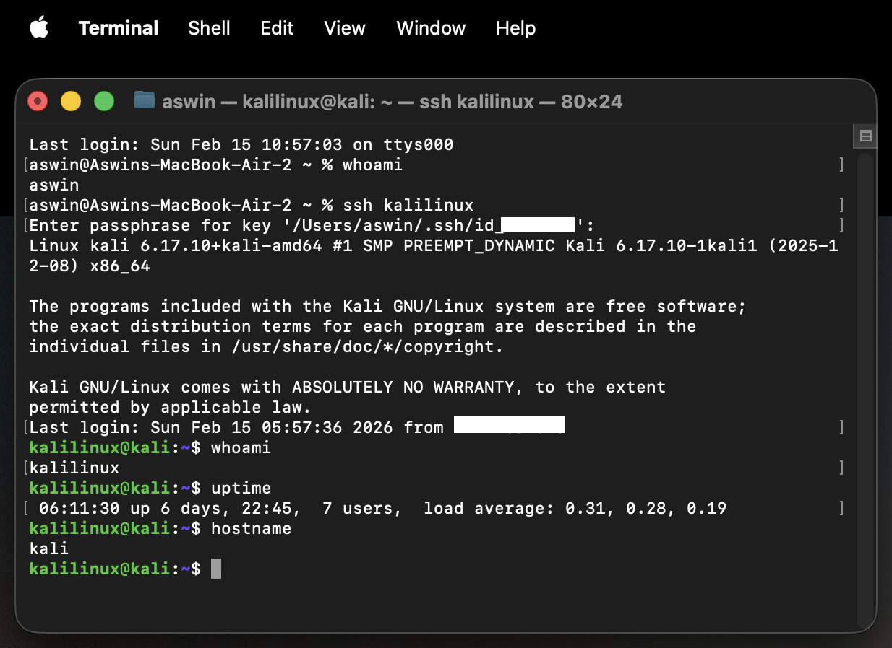
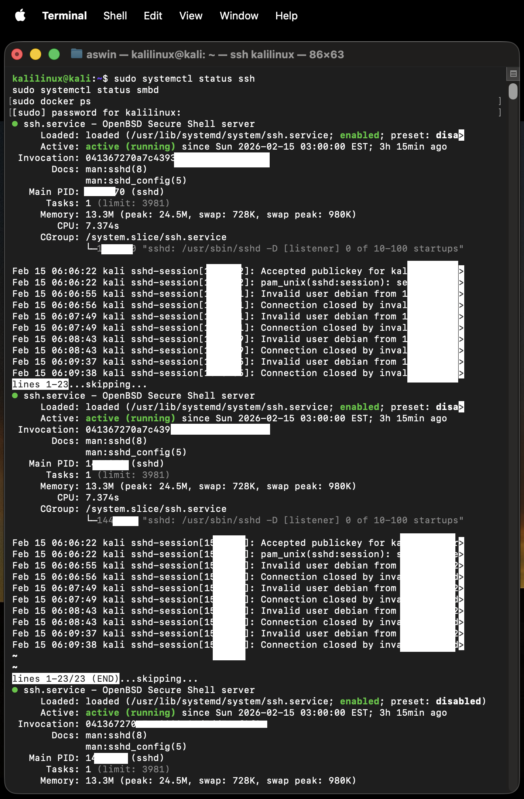
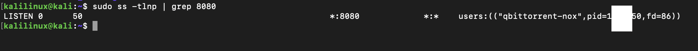
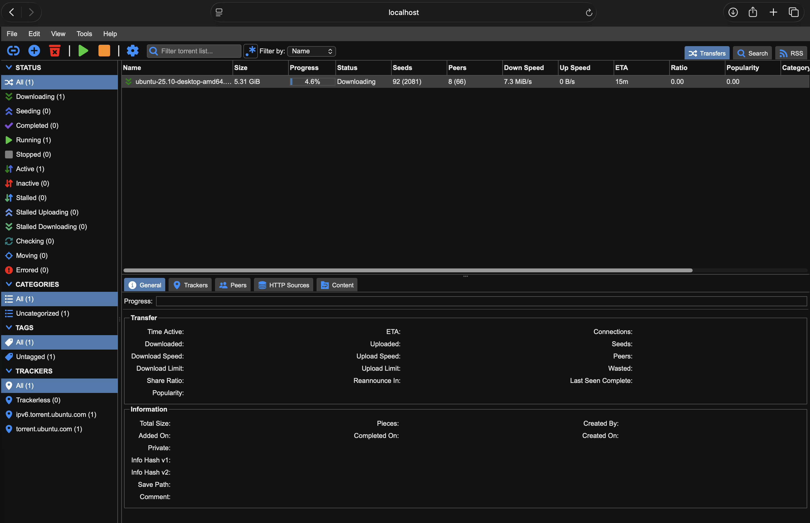
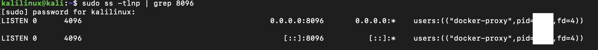
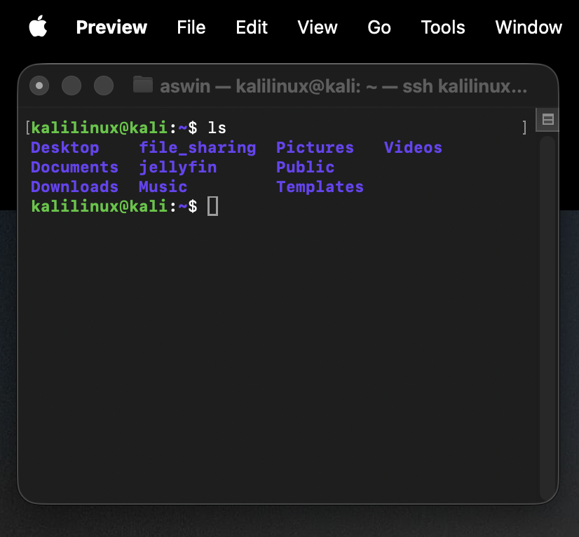

# 🏠 Self-Hosted Home Server (Kali Linux)

<p align="center">
  
  
  
  
</p>

---

## 📌 Project Summary

This project demonstrates converting an unused laptop into a secure, 24/7 self-hosted home server using **Kali Linux (Rolling Release)**.

The system provides secure remote administration, media streaming, automated downloads, and cross-platform file sharing — all hardened and sanitized for public documentation.

> 🔒 All sensitive identifiers (public IPs, usernames, hostnames, kernel IDs, router configs, PIDs, timestamps) have been masked or altered for security.

---

# 🧠 Architecture Overview



### System Flow

Client Devices (Mac / Phone / TV)  
↓  
Secure Access (SSH / Browser)  
↓  
Kali Linux Server  
↓  
Download Services (qBittorrent / aria2)  
↓  
Shared Storage  
↓  
Jellyfin Media Server  

---

# 🖥️ Hardware & OS

| Component | Details |
|------------|----------|
| Device | Repurposed laptop |
| CPU | Redacted |
| RAM | Redacted |
| Storage | Internal SSD |
| OS | Kali Linux (Rolling) |
| Network | LAN (Static DHCP Reservation) |

---

# 🔐 Secure Remote Access (SSH Hardened)

### Local Access

```bash
ssh user@192.168.0.XX
```

### Remote Access (Sanitized)

```bash
ssh user@PUBLIC_IP
```

---

## 🔑 SSH Key-Only Authentication

Password authentication disabled.  
Root login disabled.

Verification:

```bash
sudo sshd -T | egrep -i 'passwordauthentication|pubkeyauthentication'
```

Expected Output:

```
pubkeyauthentication yes
passwordauthentication no
```

### SSH Hardening Proof



---

## 🔓 SSH Login (Sanitized Proof)

- Hostname anonymized
- Usernames masked
- IP addresses removed
- Timestamps removed



---

# 🔌 Service Management & Status

Core services:

- OpenSSH
- Samba
- Docker
- Jellyfin (containerized)
- qBittorrent-nox

Verification:

```bash
sudo systemctl status ssh
sudo systemctl status smbd
sudo docker ps
```

### Services Running Proof



---

# 📥 Headless Download Stack

## qBittorrent (Web UI via SSH Tunnel)

### Port Verification

```bash
sudo ss -tlnp | grep 8080
```



### SSH Tunnel Profile

```bash
Host kali-torrent
  HostName PUBLIC_IP
  User user
  IdentityFile ~/.ssh/id_ed25519
  LocalForward 8080 localhost:8080
```

Access:

```
http://localhost:8080
```

### Web UI Dashboard



---

## aria2 CLI (Direct Downloading)

```bash
aria2c --dir=/home/user/file_sharing/Movies "magnet_link_here"
```

---

# 🎬 Jellyfin Media Server

Containerized media streaming service.

## Port Verification

```bash
sudo ss -tlnp | grep 8096
```



---

## Access

Local:
```
http://192.168.0.XX:8096
```

Remote (Secure via SSH Tunnel):
```bash
ssh kali-jellyfin
```

Then open:
```
http://localhost:8096
```

### Dashboard


---

# 📂 Samba File Sharing

Shared Directory:

```
/home/user/file_sharing
```

Client Access:

```
macOS:   smb://192.168.0.XX/file_sharing
Windows: \\192.168.0.XX\file_sharing
```

### Shared Folder Proof



---

# 🛡️ Security Controls Implemented

- SSH key-only authentication
- Password login disabled
- Root login disabled
- Static LAN IP via DHCP reservation
- Router firewall rules configured
- Admin panels accessible only via SSH tunneling
- No credentials stored in repository
- All public documentation sanitized

---

# 🔄 Headless 24/7 Operation

Configured to ignore lid close events:

```bash
sudo nano /etc/systemd/logind.conf
```

Set:

```
HandleLidSwitch=ignore
HandleLidSwitchExternalPower=ignore
```

Restart:

```bash
sudo systemctl restart systemd-logind
```

---

# 📈 Skills Demonstrated

- Linux system administration
- Systemd service management
- Docker container deployment
- SSH hardening & tunneling
- Network configuration & NAT understanding
- Secure service exposure
- Self-hosted infrastructure design
- Documentation & sanitization best practices

---

# 🚀 Planned Improvements

- WireGuard VPN (replace port forwarding)
- Reverse proxy with HTTPS (Nginx/Traefik)
- Monitoring stack (Prometheus + Grafana)
- Automated offsite backups
- Storage expansion via NAS

---

# ⚠️ Legal & Safety Disclaimer

This project is for educational and personal infrastructure development purposes only.

All screenshots and configurations are sanitized.  
No sensitive infrastructure details are exposed.

Users are responsible for complying with local laws and content regulations.